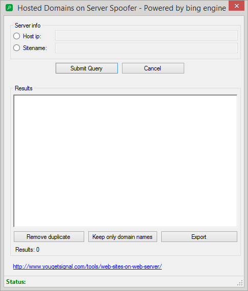

# Harvest websites hosted on the same server/networkIP
A C# Application used to get all hosted website on same IP/domainIP based on search engines.

#### What for?
  1. Harvest some data about your neighbours when using free or cheap hosting. You may not weant to host your website along with other dirty websites.
  2. Security? What if bad guys gain access to one of the websites hosted on the same server? 
  
...and because Windows console is so hard and interfaces ar so beautiful on Windows:

## Notes:
  1. It is using only Bing as search engine. For better results you may want to use multiple search engines;
  2. Don't work with Cloudflare;
  3. Application is using Bing APIs (**BingContainer.cs** - credits to it's autor);